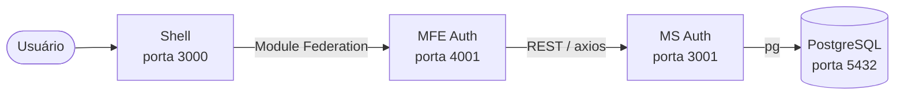

# Chave — Sistema de Autoavaliação de Competências para Pessoas Idosas

[](https://github.com/pucrs-sweii-2026-1-30/T1-ES2/actions/workflows/ci-cd.yml)

Projeto T1 de Engenharia de Software II — PUCRS / UFRGS.  
Stack **Chave**: microsserviço de autenticação + microfrontend de autenticação + shell host.

---

## Arquitetura



| Serviço | Tecnologia | Porta |
|---------|-----------|-------|
| Shell | React + Vite + React Router | 3000 |
| MFE Auth | React + TS + MUI + Module Federation | 4001 |
| MS Auth | Node.js + Express + JWT + Zod + Swagger | 3001 |
| PostgreSQL | postgres:15-alpine | 5432 |

---

## Quickstart

### Pré-requisitos

- Docker 24+ e Docker Compose v2
- (Opcional para dev local) Node.js 20+

### Subir tudo com Docker Compose

```bash
cd chave-infra-main
cp .env.example .env        # ajuste se necessário
make setup                  # faz pull, build e sobe todos os serviços
```

Verificar que tudo subiu:

```bash
make health
```

| URL | Descrição |
|-----|-----------|
| `http://localhost:3000/login` | Tela de login |
| `http://localhost:3000/register` | Tela de cadastro |
| `http://localhost:3000/home` | Dashboard (requer login) |
| `http://localhost:3001/health` | Health check do MS Auth |
| `http://localhost:3001/docs` | **Swagger UI** |

### Parar

```bash
make down
```

---

## Links rápidos

- [Swagger UI](http://localhost:3001/docs) — documentação interativa da API
- [Manual de UI](docs/UI_MANUAL.md) — telas, fluxos, acessibilidade, Module Federation
- [Architecture Decision Records](docs/adr/README.md) — 8 ADRs com trade-offs
- [Registro de uso de IA](docs/AI_USAGE.md) — template para o grupo

---

## Estrutura do repositório

```
T1ESII/
├── chave-infra-main/       # Docker Compose + Terraform (Ministack)
├── chave-ms-auth-main/     # Microsserviço de autenticação (Node/Express)
├── chave-mfe-auth-main/    # Microfrontend de autenticação (React/Vite/MUI)
├── chave-shell-main/       # Shell host (React Router + Module Federation)
└── docs/
    ├── adr/                # Architecture Decision Records
    ├── UI_MANUAL.md        # Manual de UI com fluxos e acessibilidade
    └── AI_USAGE.md         # Registro de uso de IA (Cognitrace)
```

---

## Desenvolvimento por serviço

```bash
# MS Auth
cd chave-ms-auth-main && npm install && npm run dev

# MFE Auth (porta 4001)
cd chave-mfe-auth-main && npm install && npm run dev

# Shell (porta 3000) — requer MFE rodando
cd chave-shell-main && npm install && npm run dev
```

---

## Testes

```bash
# MS Auth (Jest + supertest, cobertura ≥70%)
cd chave-ms-auth-main && npm run test:coverage

# MFE Auth (Vitest + React Testing Library)
cd chave-mfe-auth-main && npm run test:coverage
```

---

## Secrets necessários no GitHub

| Secret | Descrição |
|--------|-----------|
| `DOCKERHUB_USERNAME` | Usuário do Docker Hub (push da imagem do MS Auth) |
| `DOCKERHUB_TOKEN` | Token de acesso do Docker Hub |
